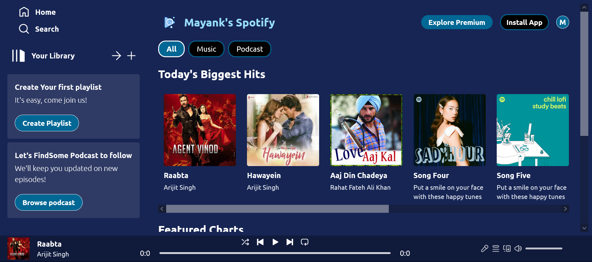

##Project Overview

This project is a Spotify clone built using React which allows the users to play their music.

##Getting started

Follow these instructions to get your copy of the project up and running on your local machine for development and testing purposes.

### 1. Clone the repository

Clone the repository to your local machine using the following command:

```sh
git clone https://github.com/mayankkalra03/celebal-week5.git
cd celebal-week5
```

### 2. Install dependencies

Install the necessary dependencies by running:

```sh
npm install
```

### 3. Start the application

Launch the application with:

```sh
npm run dev
```

### 4. Visit the application

Open http://localhost:5173 to view the application in your web browser.


